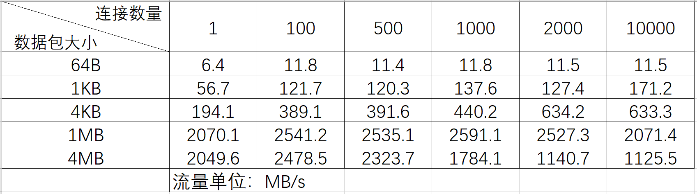
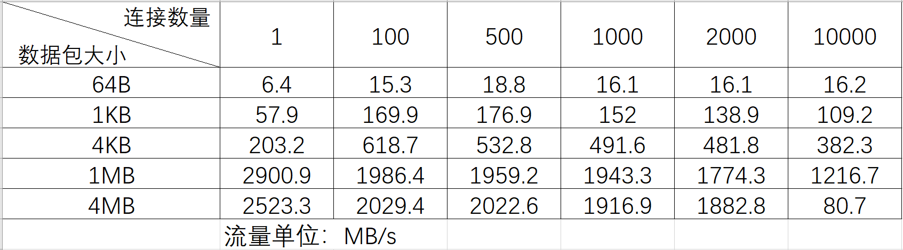

# libndsl

## summary

一个基于C++11的网络基础设施库，提供了（或将要提供）基于协程的网络和磁盘IO操作。

仍处于开发阶段，目前可用的功能：
1. 协程（由于在实现中加入了汇编级别的代码，因此目前只兼容x64-64体系架构）
2. 单线程的TCP通信（已提供基于协程的相关函数）

已有功能的用法可以参见`/test`目录下的测试用例。

## 性能测试

以下测试在如下环境的服务器下进行，使用回环网卡:

1. `Intel(R) Xeon(R) CPU E5-2603 0 @ 1.8GHz`CPU
2. 96G内存
3. `ubuntu 16.04 LTS`

### libndsl

### muduo

可以看到，在muduo由于缓存了用户输入，因此在小报文的吞吐率上更有优势；同时缓存用户输入可以让用户不用在异步网络IO期间保持Buffer的生命周期，从而使用户从Buffer的生命周期管理中解放出来。但也正因为采用了这种方式，当网络报文较大（或连接数目多）的情况下，拷贝用户缓冲区所带来的开销将变得不可忽视，这也是笔者认为其性能下降的主要原因。

而libndsl则倾向于让用户在异步网络IO期间保持Buffer的生命周期，这样可以避免用户数据到网络库之间数据传递带来的拷贝开销。在传统的基于回调的异步场景下，Buffer的生命周期管理由于可能涉及在多个回调函数之间传递，因此是非常令人头疼的。但是libndsl通过引入协程巧妙的解决了回避了问题——用户完全可以在协程栈上维持该Buffer的句柄。但是目前在小报文场景下，libndsl的表现与muduo尚有一定差距，这也是接下来我们的改进方向。